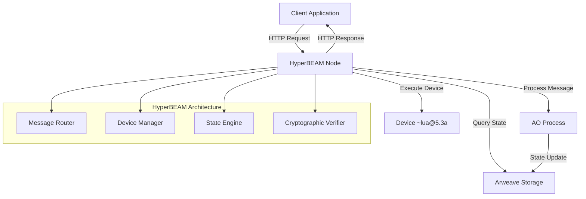

# HyperBEAM Introduction

HyperBEAM is the primary, production-ready implementation of the AO-Core protocol, built on the robust Erlang/OTP framework. It serves as a decentralized operating system, powering the AO Computer—a scalable, trust-minimized, distributed supercomputer built on the permanent storage of Arweave.

## What is HyperBEAM?

Think of HyperBEAM as your "Swiss Army knife" for decentralized development. It's not a single-purpose application, but rather a powerful, extensible engine that transforms the abstract concepts of AO-Core into a concrete, operational system.

HyperBEAM provides the runtime environment and essential services to execute computations across a network of distributed nodes, making the AO Computer accessible through familiar web technologies like HTTP.



## Core AO-Core Concepts in HyperBEAM

HyperBEAM implements the three fundamental components of AO-Core:

### Messages: Modular Data Packets

In HyperBEAM, every interaction within the AO Computer is handled as a message. Messages are cryptographically-linked data units that form the foundation for communication, allowing processes to trigger computations, query state, and transfer value.

```javascript
// Example message structure in HyperBEAM
const message = {
  Id: "MESSAGE_TX_ID",
  Process: "TARGET_PROCESS_ID", 
  Owner: "SENDER_ADDRESS",
  Data: "Hello, AO Computer!",
  Tags: [
    { name: "Action", value: "Greet" },
    { name: "Device", value: "~lua@5.3a" }
  ]
};
```

HyperBEAM nodes are responsible for routing and processing these messages according to the rules of the AO-Core protocol, ensuring reliable delivery and execution.

### Devices: Extensible Execution Engines

HyperBEAM introduces a uniquely modular architecture centered around **Devices**. These pluggable components are Erlang modules that define specific computational logic—like running WASM, managing state, or relaying data—allowing for unprecedented flexibility.

**Common HyperBEAM Devices:**

- **`~process@1.0`**: Manages persistent, shared computational states (like smart contracts)
- **`~lua@5.3a`**: Executes Lua scripts for serverless functions
- **`~wasm64@1.0`**: Executes WebAssembly code for high-performance computing
- **`~json@1.0`**: Provides JSON data structure manipulation
- **`~relay@1.0`**: Forwards messages between nodes or external HTTP endpoints
- **`~scheduler@1.0`**: Handles message ordering and execution timing

```http
# Using the Lua device to execute a calculation
GET /~lua@5.3a&script=return 2 + 2/result
# Response: 4

# Using the process device to query state
GET /PROCESS_ID~process@1.0/now/balance
# Response: Current process balance
```

### Paths: Composable Pipelines

HyperBEAM exposes a powerful HTTP API that uses structured URL patterns to interact with processes and data. This pathing mechanism allows developers to create verifiable data pipelines, composing functionality from multiple devices into a single, atomic request.

**The URL bar becomes a command-line interface** for AO's trustless compute environment.

```http
# Complex pipeline example: Calculate token supply and format as JSON
GET /TOKEN_PROCESS~process@1.0/now/~lua@5.3a&module=CALC_MODULE/sum/serialize~json@1.0

# This path:
# 1. Reads latest state of TOKEN_PROCESS
# 2. Pipes state to Lua script 
# 3. Calls 'sum' function to calculate total supply
# 4. Formats result as JSON
```

## Four Key Principles of HyperBEAM

Building with HyperBEAM can be simplified to four core principles:

### 1. Everything is a Message

You can compute on any message by calling its keys by name. The device specified in the message determines how these keys are resolved.

```http
# Direct message access
GET /~message@1.0&greeting="Hello"&count+integer=42/count
# Response: 42

# Process message
GET /PROCESS_ID~process@1.0/compute/userCount  
# Response: Number of users in the process
```

### 2. Paths are Pipelines of Messages

A path defines a sequence of 'request' messages to be executed. You can set a key in a message directly within the path using the `&key=value` syntax.

```http
# Pipeline: Get process data → Transform with Lua → Format as JSON
GET /PROCESS~process@1.0/now/~lua@5.3a&script=transform_data/result~json@1.0
```

### 3. Device-Specific Requests with `~x@y`

The `~device@version` syntax allows you to apply a request as if the base message had a different device, providing powerful compute and storage logic.

```http
# Execute Lua on process state
GET /PROCESS~process@1.0/now/~lua@5.3a&func=calculateMetrics/metrics

# Execute WASM for high-performance computing  
GET /DATA~message@1.0/~wasm64@1.0&module=WASM_MODULE/compute
```

### 4. Signed Responses over HTTP

The final message in a pipeline is returned as an HTTP response. This response is signed against the hashpath that generated it, ensuring integrity and verifiability of the computation.

```http
# Every response includes cryptographic proof
HTTP/1.1 200 OK
X-HyperBEAM-Signature: 0x123abc...
X-HyperBEAM-HashPath: path_to_computation_verification
Content-Type: application/json

{"result": 42, "verified": true}
```

## HyperBEAM Architecture

### Built on Erlang/OTP Framework

HyperBEAM leverages the battle-tested Erlang/OTP platform, providing:

**Exceptional Concurrency**
- Handle millions of lightweight processes simultaneously
- Actor model naturally maps to AO processes
- Message passing between isolated processes

**Fault Tolerance**
- "Let it crash" philosophy with supervised restarts  
- System continues operating even if individual components fail
- Automatic recovery and error isolation

**Hot Code Swapping**
- Update running code without stopping the system
- Zero-downtime deployments and upgrades
- Live system maintenance and improvements

**Distributed Systems**
- Built-in clustering and node discovery
- Network partitioning tolerance
- Transparent inter-node communication

```erlang
%% Example of HyperBEAM device implementation
-module(my_custom_device).
-export([handle_message/2]).

handle_message(Message, State) ->
    case maps:get(<<"action">>, Message, null) of
        <<"calculate">> ->
            Result = perform_calculation(Message),
            {ok, Result, State};
        _ ->
            {error, unknown_action, State}
    end.
```

### Hardware Abstraction

HyperBEAM abstracts away underlying hardware differences, allowing diverse nodes to contribute resources without compatibility issues. Whether running on:

- Consumer laptops
- Enterprise servers  
- Cloud instances
- Edge devices
- Specialized hardware (GPUs, TPUs)

All nodes can participate in the AO Computer through the common HyperBEAM interface.

## Use Cases and Applications

### Serverless Computing with Trustless Guarantees

Replace traditional cloud functions with permanently available, cryptographically verifiable compute:

```javascript
// Traditional serverless function
exports.handler = async (event) => {
    return { statusCode: 200, body: "Hello World" };
};

// HyperBEAM equivalent - permanently available on AO
// Accessible via: /PROCESS~process@1.0/hello
Handlers.add(
    "hello", 
    function() { return true; },
    function(msg) {
        ao.send({
            Target = msg.From,
            Data = "Hello from the permanent web!"
        })
    }
)
```

### Hybrid Smart Contract + Serverless Applications

Combine persistent state management with on-demand compute:

```http
# Smart contract state management
GET /TOKEN_CONTRACT~process@1.0/now/balance

# + Serverless data processing  
GET /DATA_PROCESSOR~lua@5.3a&module=ANALYTICS/process/result

# + External API integration
GET /~relay@1.0/call?method=GET&path=https://api.external.com/data
```

### Custom Execution Environments

Build specialized computational environments through custom devices:

- **AI/ML Inference**: Custom devices for model serving and GPU acceleration
- **Scientific Computing**: Devices for mathematical libraries and simulations
- **Cryptographic Applications**: Specialized devices for zero-knowledge proofs
- **Cross-chain Bridges**: Devices for interacting with other blockchain networks

### Composable Data Pipelines

Create complex, verifiable data processing workflows:

```http
# Data pipeline: Fetch → Validate → Transform → Store → Notify
GET /DATA_SOURCE/fetch/
    ~validator@1.0&schema=SCHEMA/validate/
    ~transformer@1.0&rules=RULES/transform/
    ~storage@1.0&destination=DEST/store/
    ~notifier@1.0&webhook=WEBHOOK/notify
```

## Getting Started with HyperBEAM

### Accessing HyperBEAM Nodes

HyperBEAM nodes are accessible via HTTP. You can use any node while maintaining trustless guarantees:

```javascript
// Popular HyperBEAM nodes
const NODES = [
  'https://forward.computer',
  'https://ao-mu-1.onrender.com', 
  'https://ao-cu.onrender.com'
];

// Example: Query process state
const processId = 'YOUR_PROCESS_ID';
const response = await fetch(`https://forward.computer/${processId}~process@1.0/now`);
const state = await response.json();
```

### Basic Operations

**Query Process State:**
```http
GET /PROCESS_ID~process@1.0/compute
# Returns the latest known state (faster)

GET /PROCESS_ID~process@1.0/now  
# Returns real-time state (slower, more accurate)
```

**Execute Lua Code:**
```http
GET /~lua@5.3a&script=return os.time()/result
# Returns current timestamp
```

**Send Messages to Processes:**
```javascript
import { connect, createDataItemSigner } from "@permaweb/aoconnect";

const ao = connect({
  MU_URL: "https://forward.computer"  // HyperBEAM node
});

await ao.message({
  process: "PROCESS_ID",
  tags: [
    { name: "Action", value: "Transfer" },
    { name: "Recipient", value: "RECIPIENT_ADDRESS" }, 
    { name: "Quantity", value: "100" }
  ],
  signer: createDataItemSigner(wallet)
});
```

## Security and Trust Model

### Cryptographic Verification

Every HyperBEAM response includes cryptographic proofs:

- **Signatures**: All responses signed by the executing node
- **HashPaths**: Verifiable computation trails  
- **State Hashes**: Merkle proofs of state integrity
- **Message IDs**: Tamper-evident message identification

### Trusted Execution Environments (TEEs)

Many HyperBEAM nodes run in TEEs for additional security:

```http
# Verify node is running in genuine TEE
GET /~snp@1.0/attestation
# Returns cryptographic attestation report
```

### Decentralized Trust

No single point of failure or control:
- Computation can be verified independently
- Multiple nodes can execute the same request
- Consensus mechanisms for critical operations
- Open network - anyone can run a node

## Performance Characteristics

### Concurrency

- **Millions of concurrent processes** per node
- **Lightweight message passing** between processes
- **Non-blocking I/O** for network operations
- **Parallel device execution** for complex pipelines

### Scalability

- **Horizontal scaling** through additional nodes
- **Load balancing** across node network
- **Caching layers** for frequently accessed data
- **Eventual consistency** model for global state

### Efficiency

- **Compiled code execution** via BEAM VM
- **Memory management** with garbage collection
- **Hot code reloading** for zero-downtime updates
- **Optimized message serialization** for network transport

## Network Effects

As more nodes join the HyperBEAM network:

1. **Increased Resilience**: More redundancy and fault tolerance
2. **Better Performance**: Load distribution and edge computing
3. **Enhanced Security**: More verification nodes and cryptographic diversity
4. **Expanded Capabilities**: New devices and specialized services
5. **Lower Costs**: Competition drives down execution costs

## Next Steps

Explore HyperBEAM's capabilities in detail:

1. **Learn Querying**: [Querying AO Process State](/concepts/decentralized-computing/hyperbeam/querying-ao-state)
2. **Build Serverless Functions**: [Lua Serverless Functions](/concepts/decentralized-computing/hyperbeam/lua-serverless)  
3. **Understand Devices**: [HyperBEAM Devices](/concepts/decentralized-computing/hyperbeam/hyperbeam-devices)
4. **Start Building**: [Builder's Journey](/guides/builder-journey/)

## Resources

- **HyperBEAM Official Documentation**: [HyperBEAM Docs](https://hyperbeam.arweave.net)
- **Public Nodes**: [Node Directory](https://ao.arweave.dev/networks)
- **AO Connect Integration**: [Migration Guide](https://cookbook.ao.arweave.net/guides/migrating-to-hyperbeam/)
- **Community**: [AO Discord](https://discord.gg/arweave)