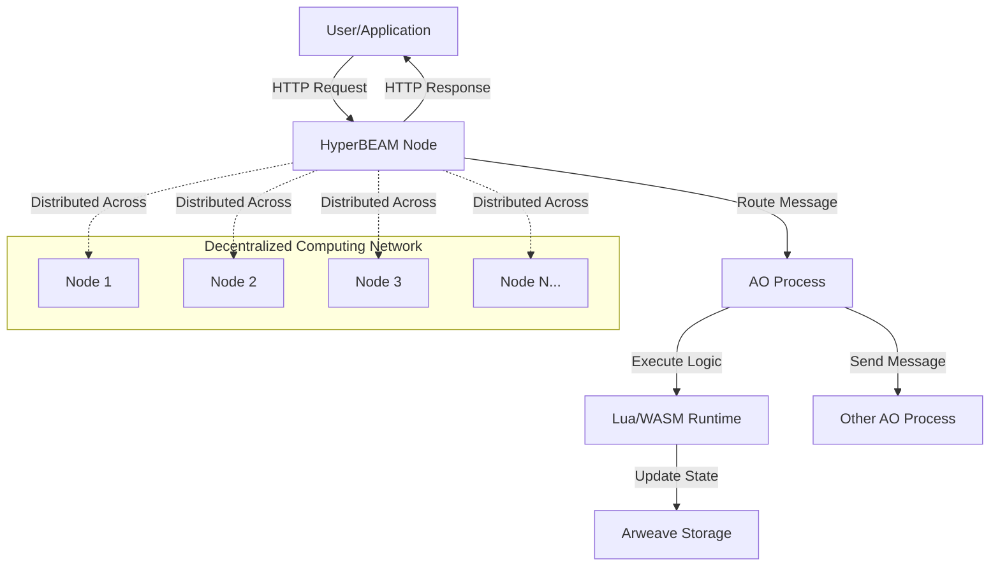

# Decentralized Computing

The Permaweb enables a new paradigm of decentralized computing that goes beyond simple data storage. Through technologies like AO (Autonomous Objects) and HyperBEAM, developers can build sophisticated applications that run permanently and trustlessly on a global, decentralized computer.

## Overview

Traditional computing relies on centralized servers and cloud providers, creating single points of failure and control. Decentralized computing on the Permaweb distributes computation across a network of nodes, ensuring permanence, censorship resistance, and trustless execution.

### Key Components

**AO Processes** - Autonomous computational units that maintain state and execute logic permanently on Arweave
**HyperBEAM** - The production implementation of AO-Core that provides HTTP access to decentralized computing resources

## Core Concepts

### Permanent Computation

Unlike traditional serverless functions that can be shut down or modified, AO processes run permanently on the Arweave network. Once deployed, they continue executing indefinitely without requiring maintenance or hosting fees.

### Trustless Execution

All computation is cryptographically verifiable. Results can be independently verified by anyone, eliminating the need to trust centralized providers or intermediaries.

### Message-Based Architecture

AO processes communicate through asynchronous message passing, enabling sophisticated distributed computing patterns while maintaining consistency and ordering.

### Device Modularity

HyperBEAM's device architecture allows different computational engines (Lua, WebAssembly, custom modules) to be plugged in as needed, creating a flexible and extensible computing environment.

## Why Decentralized Computing Matters

### Permanence
- Applications never go offline or disappear
- No vendor lock-in or platform dependencies  
- Permanent accessibility for users worldwide

### Censorship Resistance
- No single authority can shut down applications
- Global network distribution prevents blocking
- Permissionless participation in the network

### Economic Efficiency
- Pay once for permanent deployment
- No ongoing hosting or maintenance costs
- Competitive pricing through decentralized markets

### Trust Minimization
- Cryptographically verifiable execution
- Open source and auditable code
- Mathematical guarantees instead of institutional trust

## Architecture Comparison

| Aspect | Traditional Cloud | Decentralized Computing |
|--------|------------------|-------------------------|
| **Uptime** | 99.9% SLA | 100% (permanent) |
| **Control** | Platform controlled | User controlled |
| **Costs** | Monthly recurring | One-time deployment |
| **Scalability** | Manual scaling | Automatic network scaling |
| **Verification** | Trust-based | Cryptographically provable |
| **Censorship** | Platform policies | Censorship resistant |

## Learning Path

### 1. Start with AO Processes
Understand the fundamental building blocks of decentralized computing:

- **[What are AO Processes](/concepts/decentralized-computing/ao-processes/what-are-ao-processes)** - Learn the core concepts and architecture
- **[Process Communication](/concepts/decentralized-computing/ao-processes/process-communication)** - Master message passing and inter-process communication
- **[State Management](/concepts/decentralized-computing/ao-processes/state-management)** - Understand persistent state and data consistency

### 2. Explore HyperBEAM
Learn how to interact with and leverage the AO Computer:

- **[HyperBEAM Introduction](/concepts/decentralized-computing/hyperbeam/hyperbeam-introduction)** - Understand the HTTP gateway to AO
- **[Querying AO Process State](/concepts/decentralized-computing/hyperbeam/querying-ao-state)** - Master the HTTP API for data access
- **[Lua Serverless Functions](/concepts/decentralized-computing/hyperbeam/lua-serverless)** - Build serverless functions with permanent availability
- **[HyperBEAM Devices](/concepts/decentralized-computing/hyperbeam/hyperbeam-devices)** - Understand the modular device architecture

### 3. Build Applications
Apply your knowledge to real-world projects:

- **[Builder's Journey](/guides/builder-journey/)** - End-to-end development workflow
- **[Zero-deployed Full Stack App](/getting-started/zero-to-deploy)** - Quick start guide
- **[Advanced Patterns](/guides/advanced-patterns/)** - Sophisticated application architectures

## Use Cases

### Decentralized Applications (dApps)
- Token contracts and DeFi protocols
- Voting and governance systems
- Social media and content platforms
- Gaming and virtual worlds

### Serverless Computing
- API endpoints with permanent availability
- Data processing and transformation
- Scheduled tasks and automation
- Microservices architecture

### Data Processing
- ETL pipelines and analytics
- Machine learning inference
- Content delivery and caching
- Database and storage systems

### Integration and Automation
- Cross-chain bridges and oracles
- Webhook endpoints and notifications
- Workflow automation
- Third-party API integration

## Technical Benefits

### Developer Experience
- **Familiar interfaces** - HTTP APIs and standard programming languages
- **No infrastructure management** - Deploy and forget
- **Instant scaling** - Network automatically handles load
- **Built-in persistence** - State management included

### Performance Characteristics
- **Low latency** - Global edge network
- **High availability** - No single points of failure
- **Elastic scaling** - Resources scale with demand
- **Predictable costs** - One-time deployment fees

### Security Model
- **Cryptographic verification** - All execution is provable
- **Isolated execution** - Sandboxed environments
- **Immutable code** - Deployed logic cannot be changed
- **Transparent operations** - All activity is publicly auditable

## Getting Started

### Prerequisites
- Basic understanding of blockchain concepts
- Familiarity with HTTP APIs
- Programming experience (JavaScript/Lua preferred)

### Quick Start
1. **Deploy your first process** - [Zero-deployed App Guide](/getting-started/zero-to-deploy)
2. **Query process state** - [HyperBEAM Querying](/concepts/decentralized-computing/hyperbeam/querying-ao-state)
3. **Build serverless functions** - [Lua Functions Guide](/concepts/decentralized-computing/hyperbeam/lua-serverless)

### Development Tools
- **AOS** - AO Studio development environment
- **ao-connect** - JavaScript SDK for AO interaction
- **HyperBEAM nodes** - HTTP gateways to the AO Computer

## Future of Decentralized Computing

### Emerging Capabilities
- **AI/ML integration** - Permanent machine learning models
- **Advanced cryptography** - Zero-knowledge proofs and privacy
- **Cross-chain bridges** - Seamless blockchain interoperability
- **IoT integration** - Edge computing with global state

### Network Effects
As the decentralized computing network grows:
- More computational resources become available
- Specialized devices and capabilities emerge
- Costs decrease through competition
- Innovation accelerates through composability

### Industry Impact
Decentralized computing enables:
- **Platform independence** - Applications that outlive their creators
- **Global accessibility** - Permanent availability worldwide
- **Economic inclusion** - Lower barriers to application deployment
- **Innovation freedom** - Censorship-resistant development

## Community and Resources

### Documentation
- **AO Computer Docs** - [ao.arweave.dev](https://ao.arweave.dev)
- **HyperBEAM Documentation** - [hyperbeam.arweave.net](https://hyperbeam.arweave.net)
- **Arweave Developer Docs** - [docs.arweave.org](https://docs.arweave.org)

### Community
- **Discord** - [discord.gg/arweave](https://discord.gg/arweave)
- **GitHub** - [github.com/permaweb](https://github.com/permaweb)
- **Twitter** - [@ArweaveEco](https://twitter.com/ArweaveEco)

### Tools and SDKs
- **AO Connect** - JavaScript SDK for AO processes
- **AOS** - Local development environment
- **Permaweb Deploy** - Deployment tools and utilities

---

**Ready to build?** Start with [What are AO Processes](/concepts/decentralized-computing/ao-processes/what-are-ao-processes) to understand the fundamentals, then move to [HyperBEAM Introduction](/concepts/decentralized-computing/hyperbeam/hyperbeam-introduction) to learn how to interact with the AO Computer.