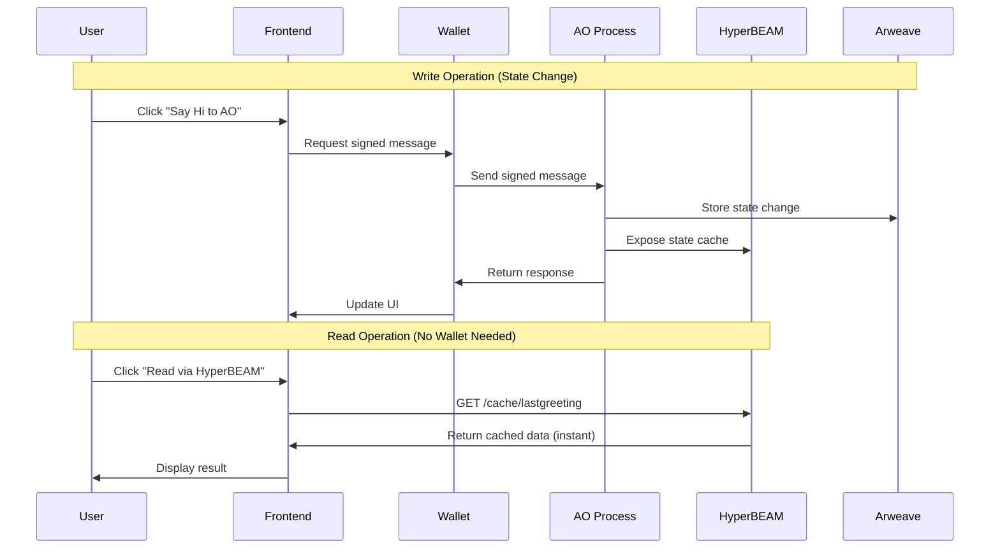

# Zero to Deployed: Your First Full Stack Permaweb App

Build and deploy a complete permaweb application with AO smart contracts in 30 minutes. This guide takes you from zero setup to a live, permanently stored web application on Arweave with real-time blockchain interaction.

## Prerequisites

Before starting, ensure you have:

- **Bun runtime** installed on your machine ([bun.sh](https://bun.sh))
- **ArConnect or Arweave.app wallet** installed in your browser
- **Basic JavaScript knowledge** (variables, functions, async/await)
- **ArNS name registered** for deployment (register at [ar.io](https://ar.io))
- **Turbo Credits** in your wallet for fast uploads (get at [turbo.ardrive.io](https://turbo.ardrive.io))

**Time to complete:** 25-30 minutes

## Step 1: Environment Setup (5 minutes)

### Install Bun Runtime

Install Bun for fast JavaScript runtime and package management:

```bash
# Install Bun (macOS/Linux)
curl -fsSL https://bun.sh/install | bash

# Or install via npm if you prefer
npm install -g bun
```

### Create Your Project

Set up your application structure:

```bash
mkdir my-permaweb-app
cd my-permaweb-app
bun init -y
```

Install the essential permaweb development tools:

```bash
bun add @permaweb/aoconnect buffer crypto-browserify events path-browserify process readable-stream stream-browserify util
bun add -d esbuild
```

### Verify Your Environment

Test that everything is working:

```bash
# Check Bun version
bun --version

# Verify wallet is installed
# Open your browser and look for the ArConnect extension icon
```

Create your `package.json` scripts section:

```json
{
  "name": "my-permaweb-app",
  "module": "src/index.js",
  "type": "module",
  "scripts": {
    "build": "bun build.js",
    "dev": "bun run build && bun run serve",
    "serve": "bun dev.js"
  }
}
```

## Step 2: Build Your Application (15 minutes)

### Create the Project Structure

Set up your application files:

```bash
mkdir src src/wallet src/animation ao public public/fonts
touch index.html build.js dev.js jsconfig.json
touch src/index.js src/app.js src/global-shim.js
touch src/wallet/WalletManager.js src/animation/hexocet.js
touch ao/ao.lua public/fonts/matrix.css
```

### Build Configuration

Create `build.js` for modern bundling with esbuild:

```javascript
import * as esbuild from 'esbuild';
import { mkdir } from 'node:fs/promises';

// Ensure dist directory exists
await mkdir('./dist', { recursive: true });

// Build the bundle
await esbuild.build({
    entryPoints: ['./src/index.js'],
    bundle: true,
    outfile: './dist/bundle.js',
    format: 'esm',
    platform: 'browser',
    target: 'es2020',
    sourcemap: true,
    inject: ['./src/global-shim.js'],
    define: {
        'global': 'window',
        'process.env.NODE_ENV': '"development"'
    },
    alias: {
        // Node.js built-in modules for browser compatibility
        'stream': 'readable-stream',
        'readable-stream': 'readable-stream',
        'buffer': 'buffer',
        'util': 'util',
        'process': 'process/browser',
        'events': 'events',
        'path': 'path-browserify',
        'crypto': 'crypto-browserify'
    }
});
```

### Development Server

Create `dev.js` for local development:

```javascript
const server = Bun.serve({
    port: 3000,
    fetch(req) {
        const url = new URL(req.url);
        
        // Serve index.html for root
        if (url.pathname === '/') {
            return new Response(Bun.file('./index.html'));
        }

        // Handle favicon
        if (url.pathname === '/favicon.ico') {
            return new Response(null, { status: 204 });
        }

        // Serve static files from dist directory
        if (url.pathname.startsWith('/dist/')) {
            const file = Bun.file(`.${url.pathname}`);
            return file.exists() 
                ? new Response(file) 
                : new Response('Not found', { status: 404 });
        }

        // Serve public files
        if (url.pathname.startsWith('/public/')) {
            const file = Bun.file(`.${url.pathname}`);
            return file.exists() 
                ? new Response(file) 
                : new Response('Not found', { status: 404 });
        }

        return new Response('Not found', { status: 404 });
    },
});

console.log(`Server running at http://localhost:${server.port}`);
```

### TypeScript Configuration

Create `jsconfig.json` for better development experience:

```json
{
  "compilerOptions": {
    "lib": ["ESNext", "DOM"],
    "target": "ESNext",
    "module": "ESNext",
    "moduleDetection": "force",
    "jsx": "react-jsx",
    "allowJs": true,
    "moduleResolution": "bundler",
    "allowImportingTsExtensions": true,
    "verbatimModuleSyntax": true,
    "noEmit": true,
    "strict": true,
    "skipLibCheck": true,
    "noFallthroughCasesInSwitch": true,
    "noUnusedLocals": false,
    "noUnusedParameters": false,
    "noPropertyAccessFromIndexSignature": false
  }
}
```

### HTML Foundation

Create `index.html`:

```html
<!DOCTYPE html>
<html>
<head>
    <title>PERMAWEB</title>
    <meta charset="UTF-8">
    <meta name="viewport" content="width=device-width, initial-scale=1.0">
    <link rel="stylesheet" href="/public/fonts/matrix.css">
</head>
<body>
    <div id="app"></div>
    <script src="/dist/bundle.js"></script>
</body>
</html>
```

### Browser Compatibility Shim

Create `src/global-shim.js` for Node.js compatibility in browsers:

```javascript
// Polyfill global object for browser environment
if (typeof window !== 'undefined') {
    // Global object
    window.global = window;
    
    // Process
    window.process = window.process || { 
        env: {},
        nextTick: (fn) => Promise.resolve().then(fn)
    };
    
    // Timers
    window.setImmediate = window.setImmediate || ((fn, ...args) => setTimeout(fn, 0, ...args));
    window.clearImmediate = window.clearImmediate || ((id) => clearTimeout(id));
    
    // Buffer
    window.Buffer = window.Buffer || require('buffer').Buffer;
    
    // Stream requirements
    window.process.browser = true;
    window.process.version = '';
    window.process.versions = { node: '' };
}
```

### Matrix Font Styling

Create `public/fonts/matrix.css`:

```css
@font-face {
  font-family: 'MatrixFont';
  src: url('https://arweave.net/qMWNCxhvqJYy4qJ31UWj5gVYRZ4-kIgB1BgXtk0QDWU') format('woff2');
  font-weight: normal;
  font-style: normal;
  font-display: swap;
}
```

### Main Application Entry

Create `src/index.js`:

```javascript
// Ensure global is defined first
if (typeof window !== 'undefined' && !window.global) {
    window.global = window;
}

// Import polyfills
import { Buffer } from 'buffer';
import crypto from 'crypto-browserify';
import path from 'path-browserify';
import process from 'process';

// Make polyfills available globally
if (typeof window !== 'undefined') {
    window.Buffer = Buffer;
    window.process = process;
    window.crypto = crypto;
    window.path = path;
    
    // Verify globals are set
    console.log('Global environment:', {
        hasGlobal: typeof global !== 'undefined',
        hasBuffer: typeof Buffer !== 'undefined',
        hasProcess: typeof process !== 'undefined',
        hasCrypto: typeof crypto !== 'undefined'
    });
}

// Initialize app
import { initApp } from './app.js';

const app = document.getElementById('app');
if (app) {
    initApp();
}
```

### Wallet Manager with AO Integration

Create `src/wallet/WalletManager.js`:

```javascript
import { message, dryrun, result, createDataItemSigner } from '@permaweb/aoconnect';

export class WalletManager {
  constructor() {
    this.walletAddress = null;
    this.authMethod = null;
    this.signer = null;
    this.isMobile = /Android|webOS|iPhone|iPad|iPod|BlackBerry|IEMobile|Opera Mini/i.test(navigator.userAgent);
    this.modal = null;
    this.initModal();
  }

  async connectWallet(method = 'ArConnect') {
    try {
      if (!window.arweaveWallet) {
        throw new Error("ArConnect not installed");
      }

      await window.arweaveWallet.connect([
        "ACCESS_ADDRESS",
        "ACCESS_PUBLIC_KEY", 
        "SIGN_TRANSACTION"
      ], {
        name: "My Permaweb App",
      });

      this.walletAddress = await window.arweaveWallet.getActiveAddress();
      this.authMethod = "ArConnect";
      this.signer = createDataItemSigner(window.arweaveWallet);
      
      this.hideModal();
      this.updateConnectButton();
      return this.walletAddress;
    } catch (error) {
      console.error("Wallet connection failed:", error);
      throw error;
    }
  }

  async sendMessageToAO(tags, data = "", processId) {
    if (!this.signer) {
      throw new Error("Signer is not initialized. Please connect wallet first.");
    }

    try {
      console.log("Sending message to AO:", { ProcessId: processId, Tags: tags });

      const messageId = await message({
        process: processId,
        tags,
        signer: this.signer,
        data: data,
      });

      console.log("Message ID:", messageId);

      // For write operations, use result to get the response
      const resultsOut = await result({
        process: processId,
        message: messageId,
        data: data,
      });
      
      const { Messages, Error } = resultsOut;
      if (Error) throw new Error(Error);

      return { Messages, Error, messageId };
    } catch (error) {
      console.error("Error sending message to AO:", error);
      throw error;
    }
  }

  async readFromHyperBEAM(processId, cachePath = 'lastgreeting') {
    try {
      const hyperbeamUrl = `https://forward.computer/${processId}~process@1.0/now/cache/${cachePath}`;
      const response = await fetch(hyperbeamUrl);
      
      if (!response.ok) {
        throw new Error(`HyperBEAM request failed: ${response.status}`);
      }
      
      const cacheData = await response.text();
      return { data: cacheData, hyperbeamUrl };
    } catch (error) {
      console.error("HyperBEAM read failed:", error);
      throw error;
    }
  }

  showModal() {
    // Modal implementation here (simplified for guide)
    this.modal.style.display = 'flex';
  }

  hideModal() {
    this.modal.style.display = 'none'; 
  }

  initModal() {
    // Create modal element (implementation details)
    this.modal = document.createElement('div');
    this.modal.className = 'wallet-modal';
    this.modal.style.display = 'none';
    document.body.appendChild(this.modal);
  }

  updateConnectButton() {
    const button = document.getElementById('wallet-button');
    if (!button) return;
    
    if (this.walletAddress) {
      button.textContent = `${this.walletAddress.slice(0, 6)}...${this.walletAddress.slice(-4)}`;
      button.classList.add('connected');
    } else {
      button.textContent = 'Connect Wallet';
      button.classList.remove('connected');
    }
  }
}

export default new WalletManager();
```

### Application Logic with AO Communication

Create `src/app.js`:

```javascript
import walletManager from './wallet/WalletManager.js';

export function initApp() {
    const app = document.getElementById('app');
    if (!app) return;

    // Create main heading container
    const headingContainer = document.createElement('div');
    headingContainer.className = 'heading-container';

    // Create AO interaction button
    const aoButton = document.createElement('button');
    aoButton.className = 'side-button ao-button';
    aoButton.textContent = 'Say Hi to AO';
    
    // Create HyperBEAM read button
    const hyperbeamButton = document.createElement('button');
    hyperbeamButton.className = 'side-button hyperbeam-button';
    hyperbeamButton.textContent = 'Read via HyperBEAM';
    
    // AO Process interaction handler
    aoButton.onclick = async () => {
        try {
            if (!walletManager.signer) {
                rightMessage.textContent = 'AO says: Connect wallet first!';
                await new Promise(resolve => setTimeout(resolve, 2000));
                walletManager.showModal();
                return;
            }

            rightMessage.innerHTML = '<div class="loading-dots">Connecting to AO<span>.</span><span>.</span><span>.</span></div>';
            aoButton.disabled = true;

            const tags = [
                { name: 'Action', value: 'Greeting' },
                { name: 'App-Name', value: 'Permaweb-App' },
                { name: 'App-Version', value: '1.0' },
                { name: 'Message', value: 'Hello AO!' }
            ];

            // Replace with your AO Process ID
            const processId = 'YOUR_AO_PROCESS_ID_HERE';
            const { Messages, Error, messageId } = await walletManager.sendMessageToAO(tags, '', processId);

            if (Messages?.length) {
                const message = JSON.parse(Messages[0].Data);
                rightMessage.innerHTML = `
                    <div class="message-container">
                        <div class="message-body">
                            <div class="message-text">${message.greeting}</div>
                            <div class="message-meta">
                                <span class="message-from">From: ${message.from.slice(0, 6)}...${message.from.slice(-4)}</span>
                                <a href="https://ao.link/#/message/${messageId}" target="_blank" class="message-link">View on AO</a>
                            </div>
                        </div>
                    </div>
                `;
            }
        } catch (error) {
            console.error('AO Communication Error:', error);
            rightMessage.innerHTML = `<div class="message-error">⚠️ Connection failed</div>`;
        } finally {
            aoButton.disabled = false;
        }
    };

    // HyperBEAM read handler
    hyperbeamButton.onclick = async () => {
        try {
            rightMessage.innerHTML = '<div class="loading-dots">Reading from HyperBEAM<span>.</span><span>.</span><span>.</span></div>';
            hyperbeamButton.disabled = true;

            const processId = 'YOUR_AO_PROCESS_ID_HERE';
            const { data, hyperbeamUrl } = await walletManager.readFromHyperBEAM(processId, 'lastgreeting');

            const timestamp = new Date().toLocaleTimeString();
            rightMessage.innerHTML = `
                <div class="message-container">
                    <div class="message-header">
                        <span class="message-time">${timestamp}</span>
                        <span class="message-status">⚡</span>
                    </div>
                    <div class="message-body">
                        <div class="message-text">Latest Greeting: "${data}"</div>
                        <div class="hyperbeam-info">
                            <div class="hyperbeam-label">⚡ Fetched via HyperBEAM</div>
                            <a href="${hyperbeamUrl}" target="_blank" class="hyperbeam-url">${hyperbeamUrl}</a>
                        </div>
                    </div>
                </div>
            `;
        } catch (error) {
            console.error('HyperBEAM Read Error:', error);
            rightMessage.innerHTML = `
                <div class="message-error">
                    <span class="error-icon">⚠️</span>
                    <span class="error-text">HyperBEAM read failed</span>
                </div>
            `;
        } finally {
            hyperbeamButton.disabled = false;
        }
    };

    // Create main heading
    const heading = document.createElement('h1');
    heading.className = 'main-heading';
    heading.textContent = 'PERMAWEB';

    // Create right side message area
    const rightMessage = document.createElement('div');
    rightMessage.className = 'side-message right-message';
    rightMessage.textContent = 'AO says: ...';

    // Create wallet button
    const walletButton = document.createElement('button');
    walletButton.id = 'wallet-button';
    walletButton.textContent = 'Connect Wallet';
    walletButton.onclick = () => walletManager.showModal();

    // Create button container
    const buttonContainer = document.createElement('div');
    buttonContainer.className = 'button-container';
    buttonContainer.appendChild(aoButton);
    buttonContainer.appendChild(hyperbeamButton);

    // Apply styles
    const style = document.createElement('style');
    style.textContent = `
        body {
            margin: 0;
            padding: 0;
            overflow: hidden;
            background: #fafafa;
            font-family: 'MatrixFont', monospace;
        }

        .heading-container {
            position: fixed;
            top: 50%;
            left: 50%;
            transform: translate(-50%, -50%);
            display: flex;
            align-items: center;
            gap: 2rem;
            z-index: 2;
            width: 90%;
            max-width: 1200px;
            justify-content: space-between;
        }

        .main-heading {
            font-size: 4rem;
            font-weight: bold;
            color: #1a1a1a;
            text-align: center;
            margin: 0;
            letter-spacing: 0.1em;
        }

        .side-button {
            padding: 1rem 2rem;
            border: 1px solid #1a1a1a;
            font-family: 'MatrixFont', monospace;
            cursor: pointer;
            transition: all 0.2s ease;
            font-size: 1rem;
            background: rgba(255, 255, 255, 0.9);
        }

        .side-button:hover {
            transform: translateY(-0.5px);
            box-shadow: 0 4px 8px rgba(74, 26, 109, 0.1);
        }

        .side-button:disabled {
            opacity: 0.5;
            cursor: not-allowed;
        }

        .hyperbeam-button {
            background: linear-gradient(135deg, #FFD700, #FFA500);
            color: #1a1a1a;
            font-weight: bold;
        }

        .side-message {
            min-width: 280px;
            padding: 1rem;
            background: rgba(255, 255, 255, 0.9);
            font-family: 'MatrixFont', monospace;
            color: #1a1a1a;
            text-align: center;
        }

        .message-container {
            background: rgba(255, 255, 255, 0.95);
            border-radius: 12px;
            padding: 1rem;
        }

        .loading-dots span {
            animation: dots 1.5s infinite;
            opacity: 0;
        }

        .loading-dots span:nth-child(1) { animation-delay: 0.0s; }
        .loading-dots span:nth-child(2) { animation-delay: 0.3s; }
        .loading-dots span:nth-child(3) { animation-delay: 0.6s; }

        @keyframes dots {
            0% { opacity: 0; }
            50% { opacity: 1; }
            100% { opacity: 0; }
        }

        #wallet-button {
            position: fixed;
            top: 1rem;
            right: 1rem;
            padding: 0.5rem 1rem;
            background: #652494;
            color: white;
            border: none;
            border-radius: 8px;
            cursor: pointer;
            font-family: 'MatrixFont', monospace;
        }

        .button-container {
            display: flex;
            flex-direction: column;
            gap: 0.5rem;
        }

        .hyperbeam-info {
            margin-top: 0.5rem;
            padding: 0.5rem;
            background: rgba(255, 215, 0, 0.1);
            border-radius: 8px;
        }

        .hyperbeam-label {
            font-size: 0.8rem;
            color: #FFB000;
            font-weight: bold;
        }
    `;

    document.head.appendChild(style);

    // Append elements
    headingContainer.appendChild(buttonContainer);
    headingContainer.appendChild(heading);  
    headingContainer.appendChild(rightMessage);

    app.appendChild(headingContainer);
    app.appendChild(walletButton);

    console.log('🌐 Permaweb app initialized!');
}
```

### AO Smart Contract (Lua)

Create `ao/ao.lua` for your backend logic:

```lua
local json = require("json")

-- Initialize state variables
Greetings = Greetings or {}
LastGreeting = LastGreeting or "No greetings yet"

-- Expose process state via HyperBEAM
local function exposeState()
  Send({ 
    Target = "~patch@1.0",
    device = "patch@1.0", 
    cache = { 
      greetings = Greetings,
      lastgreeting = LastGreeting,
      totalgreetings = #Greetings
    } 
  })
end

-- Handle greeting messages
Handlers.add(
  "Greeting",
  Handlers.utils.hasMatchingTag("Action", "Greeting"),
  function (msg)
    local sender = msg.From
    local timestamp = os.time()
    local greeting = "Hello from AO!"
    
    local response = {
      from = sender,
      timestamp = timestamp,
      greeting = greeting
    }
    
    -- Update state
    table.insert(Greetings, response)
    LastGreeting = greeting
    
    -- Expose updated state for HyperBEAM
    exposeState()
    
    -- Reply with the greeting
    Handlers.utils.reply(msg, json.encode(response))
  end
)


-- Initial state exposure
exposeState()
```

### Test Your Application Locally

Start your development server:

```bash
bun run dev
```

Visit `http://localhost:3000` to see your app running locally. You should see:
- A modern interface with Matrix-style fonts
- Connect wallet button
- AO interaction buttons (will need AO process deployed first)
- Real-time feedback

## Step 3: Deploy Your AO Process (10 minutes)

Before deploying your frontend, you need to deploy your AO process for backend logic.

### Install AO CLI

```bash
# Install the AO CLI globally
npm install -g https://get_ao.g8way.io
```

### Deploy Your Process

```bash
# Navigate to your AO directory
cd ao

# Deploy the Lua process
aos --load ao.lua

# In the AOS console, note your process ID
# It will look like: aos@1.0.0 (Process: abc123...def789)
```

### Update Process ID

Replace `YOUR_AO_PROCESS_ID_HERE` in your `src/app.js` with your actual process ID from the deployment.

### Test AO Process

Test your process manually:

```bash
# In AOS console
Send({ Target = ao.id, Action = "Greeting", Data = "Test" })

# Should respond with greeting data
# Check HyperBEAM endpoint works:
# https://forward.computer/[YOUR_PROCESS_ID]~process@1.0/now/cache/lastgreeting
```

## Step 4: Deploy Frontend to Permaweb (10 minutes)

### Build for Production

Create your production build:

```bash
bun run build
```

This creates a `dist/` folder with your bundled application.

### Install Permaweb Deploy

Add the correct deployment tool:

```bash
bun add -d permaweb-deploy
```

### Prepare Your Wallet

Encode your Arweave wallet in base64 format:

```bash
# Encode your wallet file
base64 -i wallet.json | pbcopy
```

Set this as your `DEPLOY_KEY` environment variable.

### Update Package.json Scripts

Add deployment scripts to your `package.json`:

```json
{
  "scripts": {
    "build": "bun build.js",
    "dev": "bun run build && bun run serve", 
    "serve": "bun dev.js",
    "deploy": "bun run build && permaweb-deploy --arns-name my-permaweb-app",
    "deploy-staging": "bun run build && permaweb-deploy --arns-name my-permaweb-app --undername staging"
  }
}
```

### Deploy Your Application

**Option 1: Deploy to ArNS Name Root**
```bash
# Set your encoded wallet as environment variable
export DEPLOY_KEY=$(base64 -i wallet.json)

# Deploy to root of your ArNS name
bun run deploy
```

**Option 2: Deploy to ArNS Undername**
```bash
# Deploy to staging subdomain
DEPLOY_KEY=$(base64 -i wallet.json) bunx permaweb-deploy --arns-name my-permaweb-app --undername staging
```

**Option 3: Deploy Single Build File**
```bash
# Deploy just the bundle file
DEPLOY_KEY=$(base64 -i wallet.json) bunx permaweb-deploy --arns-name my-permaweb-app --deploy-file dist/bundle.js
```

### CLI Options Reference

- `--arns-name, -n` (required): Your ArNS name (e.g., "my-permaweb-app")
- `--deploy-folder, -d`: Folder to deploy (default: `./dist`)
- `--undername, -u`: Deploy to subdomain (e.g., "staging")
- `--ttl-seconds, -t`: Cache TTL in seconds (60-86400, default: 3600)
- `--ario-process, -p`: Network (`mainnet`, `testnet`, or custom process ID)

### Deployment Results

After successful deployment, you'll receive:
- **Transaction ID**: Your app's permanent Arweave address
- **ArNS URL**: `https://my-permaweb-app.ar.io` (your custom domain)
- **Arweave Gateway URL**: `https://arweave.net/[transaction-id]`
- **Update confirmation**: ArNS record updated with new transaction ID

### GitHub Actions Deployment (Optional)

For automated deployment, create `.github/workflows/deploy.yml`:

```yaml
name: Deploy to Permaweb
on:
  push:
    branches:
      - main
jobs:
  publish:
    runs-on: ubuntu-latest
    steps:
      - uses: actions/checkout@v4
      - uses: actions/setup-node@v4
        with:
          node-version: 20.x
      - uses: oven-sh/setup-bun@v1
        with:
          bun-version: latest
      - run: bun install
      - run: bun run deploy
        env:
          DEPLOY_KEY: ${{ secrets.DEPLOY_KEY }}
```

**Setup:**
1. Add your base64-encoded wallet as a GitHub secret named `DEPLOY_KEY`
2. Replace `my-permaweb-app` in your deploy script with your actual ArNS name
3. Push to main branch to trigger deployment

## Step 5: Understanding Your Full-Stack App (5 minutes)

### Architecture Overview

Your permaweb application now consists of:

**Frontend (Permaweb)**:
- Modern JavaScript with Web Components  
- Bun + esbuild for optimal bundling
- ArConnect wallet integration
- HyperBEAM real-time data access

**Backend (AO Process)**:
- Lua-based smart contract execution
- Permanent state storage on Arweave
- HyperBEAM state exposure for fast reads
- Message-based interaction model

**Integration Layer**:
- `@permaweb/aoconnect` for AO process communication
- HyperBEAM direct reads (no wallet required)  
- Real-time UI updates from blockchain state

### Communication Flow



### Key Technologies Demonstrated

- **Bun Runtime**: Fast JavaScript execution and package management
- **esbuild**: Lightning-fast bundling with tree-shaking
- **AO Protocol**: Decentralized compute with permanent storage
- **HyperBEAM**: Real-time blockchain state access
- **ArConnect**: Secure wallet integration
- **Permaweb**: Permanent, decentralized hosting

## Next Steps

Congratulations! You've built and deployed a full-stack decentralized application. Here are your next learning paths:

### For Frontend Developers
- **Framework Integration**: Add React, Vue, or Svelte on top of this foundation
- **Advanced UI**: Implement complex animations and interactions
- **PWA Features**: Add offline functionality and service workers
- **Multi-wallet Support**: Integrate additional wallet providers

### for Backend Developers  
- **Advanced AO Patterns**: Implement token contracts, DAOs, and DeFi protocols
- **Process Communication**: Build multi-process architectures
- **Data Indexing**: Use GraphQL for complex data queries
- **Performance Optimization**: Implement caching and batching strategies

### For Full-Stack Builders
- **Real-time Applications**: Build chat apps, games, and collaborative tools
- **E-commerce**: Create decentralized marketplaces
- **Social Networks**: Build permanent social platforms
- **Developer Tools**: Create deployment and monitoring tools

## Troubleshooting

**Common Issues:**

| Problem | Solution |
|---------|----------|
| ArConnect not detected | Install ArConnect browser extension and refresh |
| Build fails | Ensure Bun is installed correctly (`bun --version`) |
| AO process not responding | Verify process ID and deployment with `aos` |
| HyperBEAM cache empty | Send a message to populate state first |
| "ARNS_NAME not configured" | Ensure you're passing `--arns-name` with a valid ArNS name |
| "DEPLOY_KEY not configured" | Verify your base64 encoded wallet is set as `DEPLOY_KEY` |
| "deploy-folder does not exist" | Check that your `dist/` folder exists after running build |
| "ARNS name does not exist" | Verify the ArNS name exists and you have ownership rights |
| Upload timeouts | Large files may fail; optimize your build or split assets |
| Insufficient Turbo Credits | Ensure your wallet has enough Turbo Credits for deployment |

**Need Help?**
- Join [Arweave Discord](https://discord.gg/arweave) `#ao-dev` channel
- Check [AO Cookbook](https://cookbook_ao.ar.io) for advanced patterns
- Browse [Permaweb Examples](https://cookbook.arweave.dev/references/gateways.html)

## Resources

- **Template Repository**: [dpshade-minimal-permaweb](https://github.com/example/template)
- **AO Documentation**: [https://cookbook_ao.ar.io](https://cookbook_ao.ar.io)  
- **Arweave Developer Docs**: [https://docs.arweave.org](https://docs.arweave.org)
- **HyperBEAM Guide**: [forward.computer](https://forward.computer)
- **Community**: [Arweave Builders Discord](https://discord.gg/arweave)

---

**Estimated cost**: 0.01-0.1 AR tokens (~$0.01-$0.10 USD)  
**Deployment time**: 1-3 minutes  
**Permanence**: Forever ♾️
**Performance**: Sub-second HyperBEAM reads, ~2s blockchain writes